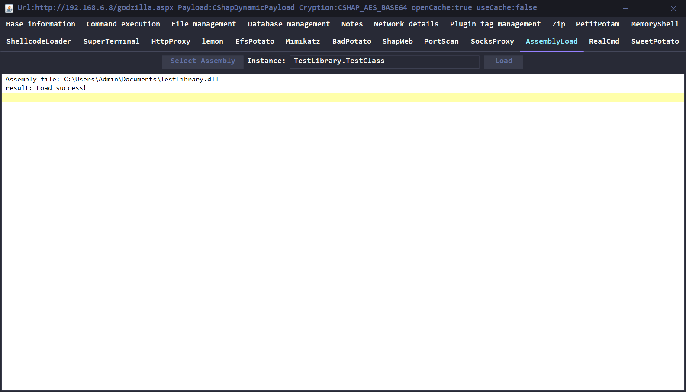

# Godzilla AssemblyLoad Plugin
[](https://opensource.org/licenses/Apache-2.0)

## 简介
Godzilla Assembly Load插件用于在Godzilla CShap Webshell上加载自定义C#程序集并创建指定类的实例。

## 安装
在Godzilla目录下创建`plugins`文件夹
```bash
mkdir plugins
```

下载并解压插件
```bash
cd plugins

wget https://github.com/wat4r/GodzillaAssemblyLoadPlugin/releases/download/v1.0.0/AssemblyLoad.zip

unzip AssemblyLoad.zip
```

文件目录结构如下
```bash
Godzilla
│   data.db
│   godzilla.jar
│
└───plugins
    └───AssemblyLoad
        │   AssemblyLoad.jar
        │
        └───assets
                AssemblyLoad.dll
```

## 使用
1. 选择需要加载的C#程序集（.dll或.exe）
2. 输入类的完全限定名（即包括命名空间）
3. 点击Load
4. 类的构造函数将会被执行

